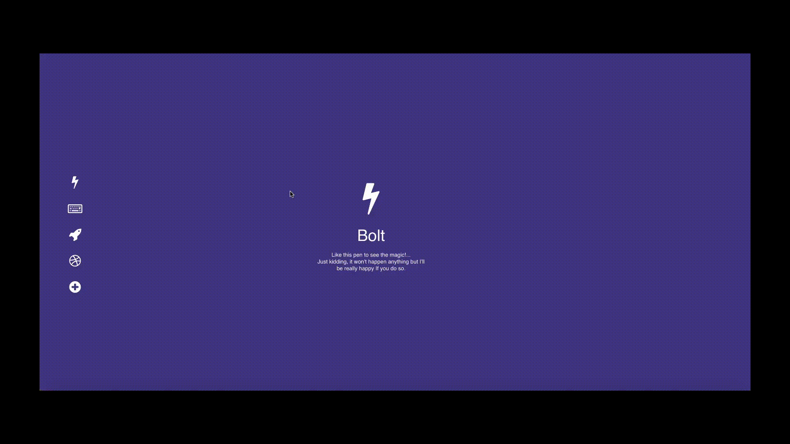
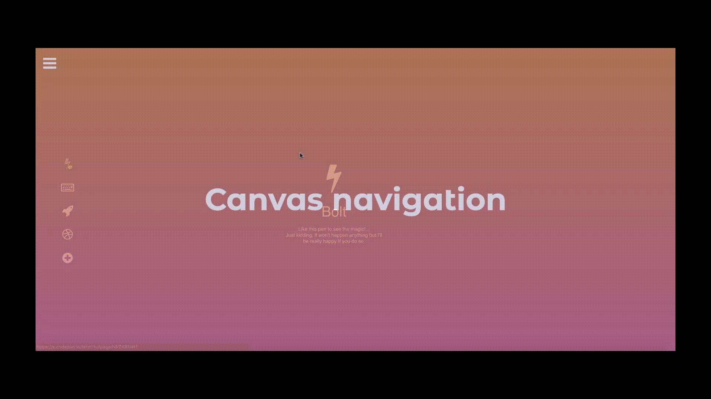
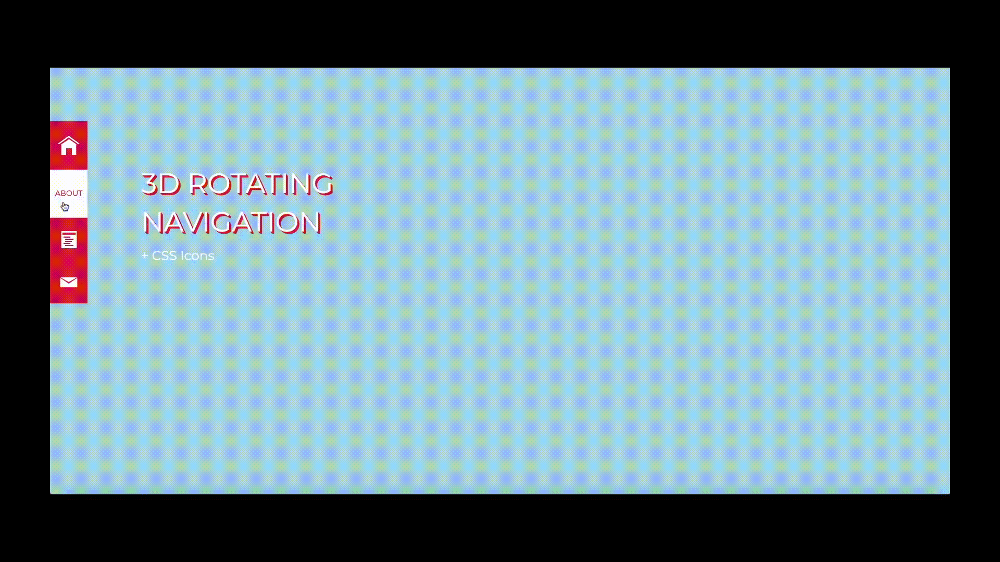
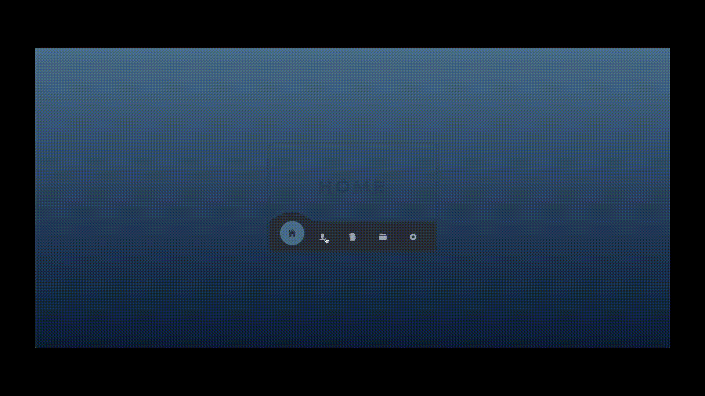
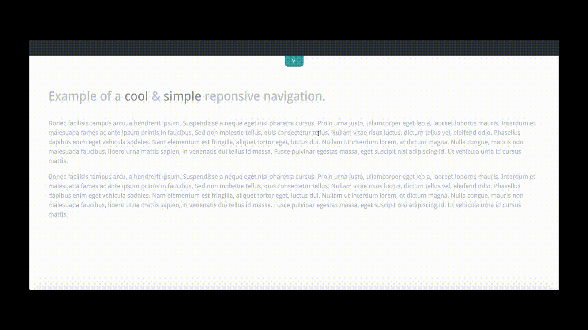
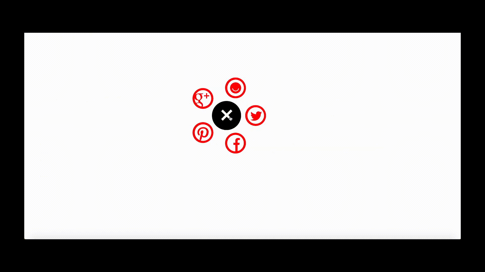
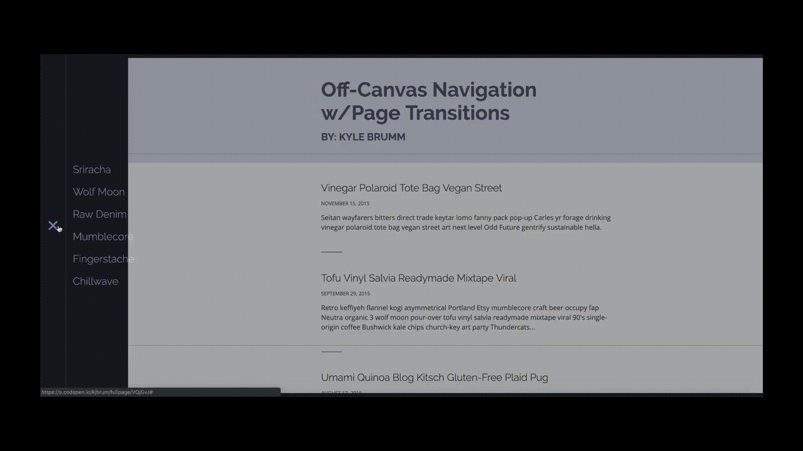
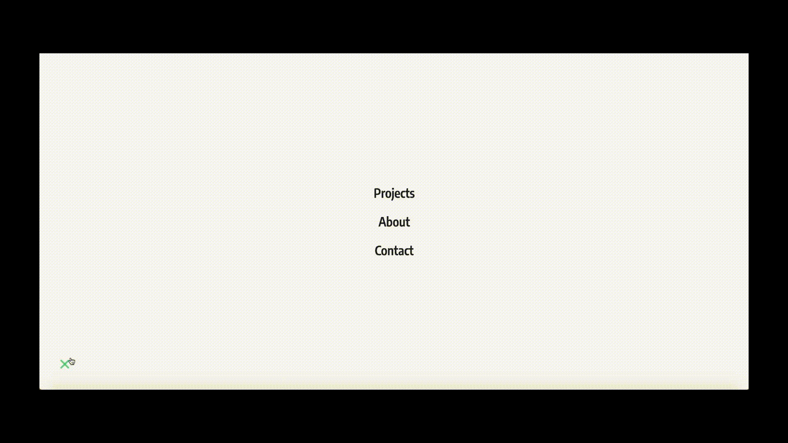
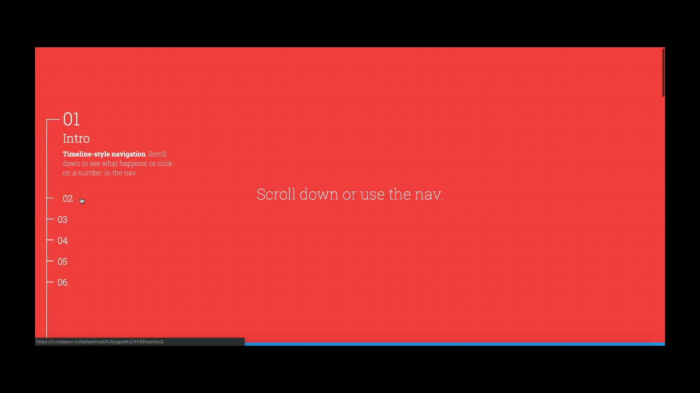

# Creative Navbar Designs Using HTML,CSS & JS
*Navigate more fashionably!! Catch 10 creative Navbar designs from [Codepen](https://codepen.io/)*

### 1. [One Page Navigation CSS Menu](https://codepen.io/hrtzt/full/NPZKRN)

### 2. [Canvas Navigation](https://codepen.io/trhino/full/ujHan)

### 3. [3D Rotating Navigation](https://codepen.io/arjancodes/full/wtqIr)

### 4. [Mobile Navigation Concept](https://codepen.io/tobiasglaus/full/qQLjYZ)

###  5. [Responsive Navbar Design](https://codepen.io/antoinevinial/full/lnwyC)

### 6. [Radial Pop-Out Navigation](https://codepen.io/dudleystorey/full/emVqYR)

### 7. [Off-Canvas Navigation](https://codepen.io/kjbrum/full/VQjGvJ)

### 8. [Floating Circle Navigation](https://codepen.io/dannievinther/full/JrdPoM)

### 9. [Timeline Style Navigation](https://codepen.io/nailaahmad/full/MyZXVE)

### 10. [Stacked Card Style Navigation](https://codepen.io/zhydeikina/full/JwgEbe)

